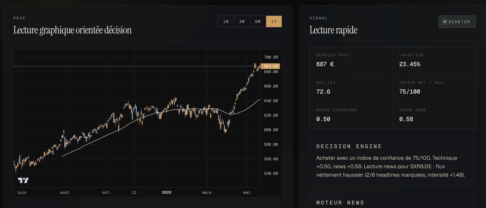

# bot_trading

Dashboard de marche avec une interface React et un backend Python FastAPI.



## Stack

- React + TypeScript + Vite pour l'interface
- FastAPI + Python pour l'API locale
- Yahoo Finance pour les prix
- Google News RSS pour les headlines
- OpenRouter en option pour l'analyse news au LLM

## Installation

```bash
npm install
pip install -r requirements.txt
```

## Variables d'environnement

Copie `.env.example` vers `.env` pour configurer le port local et l'acces OpenRouter.

```bash
cp .env.example .env
```

Puis renseigne si besoin:

```env
OPENROUTER_API_KEY=ta_cle_api
OPENROUTER_MODEL=anthropic/claude-sonnet-4.6
PORT=8787
```

## Lancement en developpement

```bash
npm run dev
```

Services lances:

- Frontend Vite: http://localhost:5173
- API FastAPI: http://localhost:8787

Presets par defaut:

- S&P 500 via `SXR8.DE`
- Emerging Markets via `IS3N.DE`
- Stoxx Europe 600 via `EXSA.DE`

Ces trois trackers remontent deja en euro depuis Yahoo Finance.

## Signal buy/sell

Le backend Python expose maintenant `/api/signal` et combine:

- tendance vs moyenne mobile 50 jours
- RSI 14 jours
- momentum et confirmation par les volumes
- lecture des headlines Google News
- analyse LLM via OpenRouter si `OPENROUTER_API_KEY` est configuree

Le resultat contient une action (`buy`, `hold`, `sell`) et un indice de confiance sur 100.

## Build de production

```bash
npm run build
npm run start
```

Le serveur Express sert alors l'application compilee depuis `dist/`.

## Fonctionnalites

- Recherche de ticker libre
- Vue chandelier avec moyenne mobile 50 jours
- KPI rapides: close, variation, volume moyen, range 52 semaines
- Rail d'evenements base sur les headlines
- Synthese locale basee sur les headlines recentes
- Signal achat/vente avec score de confiance
